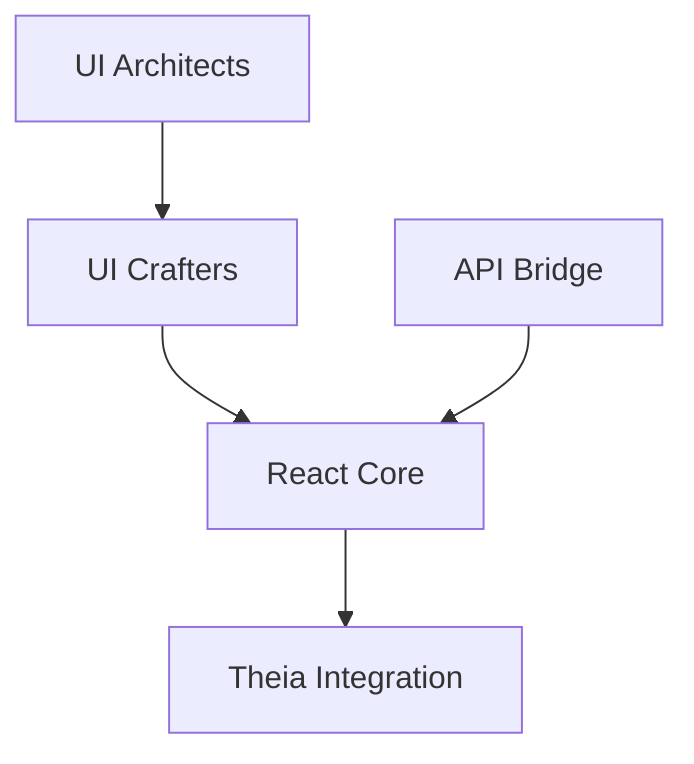
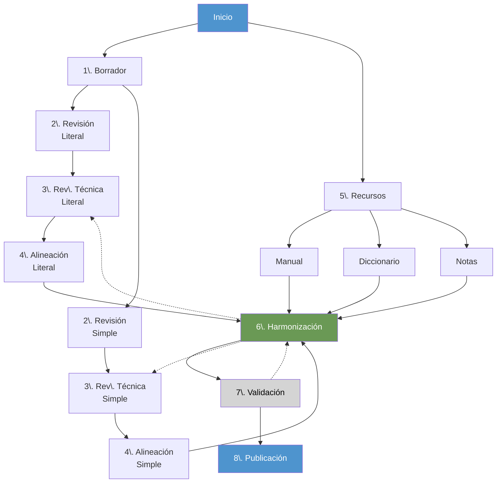

# OCE Hackathon 2025 - Idiomas Puentes

## **TLDR (Resumen Ejecutivo)**

### Proyecto

TaskFlow DCS (Gitea)

### ¿Qué es?

Una extensión para Theia IDE que gestiona el flujo de trabajo de traducción bíblica en DCS (Door43 Content Service), con capacidades offline-first.

### **Equipo y Contexto**

- Hackathon de 4 días
- 5 equipos distribuidos en LATAM
- Desarrolladores de diferentes niveles
- Liderado por Abel Pérez

### **Equipos**

1. **UI Architects**: Diseño UX/UI
2. **UI Crafters**: Maquetación HTML/CSS
3. **API Bridge**: Lógica TypeScript
4. **React Core**: Componentes React
5. **Theia Integration**: Integración con IDE

### **Características Principales**

- Gestión de flujo de traducción de 8 etapas
- Trabajo offline con sincronización automática
- Interfaz integrada en Theia IDE
- Sistema de resolución de conflictos

### **Stack Tecnológico**

- Frontend: TypeScript, React, Tailwind
- IDE: Theia
- Backend: DCS (Gitea) API
- Storage: IndexedDB para offline

### **Objetivo Final**

MVP funcional que permita gestionar el flujo completo de traducción bíblica, desde el borrador inicial hasta la publicación, con soporte para trabajo sin conexión.

### **Prototipo Visual Inicial**
🎨 [Ver Prototipo HTML](./example.html) - Implementación inicial de la interfaz que muestra:
- Layout general de la extensión dentro del IDE Eclipse Theia
- Sistema de gestión de tareas
- Flujo de trabajo de traducción
- Estilos y componentes base
- Interacciones básicas

> **Nota**: Este prototipo no representa el diseño objetivo para el MVP. Sin embargo, los equipos pueden usarlo como referencia visual durante el desarrollo.

> **Tip**: Usa este prototipo como guía visual durante el desarrollo, pero siéntete libre de proponer mejoras.

## **Tabla de Contenidos**

1. [Equipo del Hackathon](#equipo-del-hackathon)
   - [Liderazgo](#liderazgo)
   - [UI Architects](#equipo-1-ui-architects)
   - [UI Crafters](#equipo-2-ui-crafters)
   - [API Bridge](#equipo-3-api-bridge)
   - [React Core](#equipo-4-react-core)
   - [Theia Integration](#equipo-5-theia-integration)
   - [Consultores](#consultores)

2. [Introducción](#introducción)
   - [¿Por qué Theia?](#por-qué-theia)
   - [Contexto del Desarrollo](#contexto-del-desarrollo)
   - [Objetivo Principal](#objetivo-principal)
   - [Características Clave](#características-clave)
   - [Usuarios Objetivo](#usuarios-objetivo)
   - [Integración con DCS](#integración-con-dcs)
   - [Alcance del Proyecto](#alcance-del-proyecto)

3. [Equipos y Responsabilidades](#1-equipos-y-responsabilidades)
   - [UI Architects](#equipo-1-ui-architects-diseñadores-uxui)
   - [UI Crafters](#equipo-2-ui-crafters-maquetadores-htmlcss)
   - [API Bridge](#equipo-3-api-bridge-lógica-typescript)
   - [React Core](#equipo-4-react-core-integración-ui--api)
   - [Theia Integration](#equipo-5-theia-integration)

4. [Detalles de Implementación UI](#10-detalles-de-implementación-ui)
   - [Estructura de la Interfaz](#estructura-de-la-interfaz)
   - [Interacciones](#interacciones)
   - [Estilos](#estilos)
   - [Tecnologías Frontend](#tecnologías-frontend)
   - [Consideraciones de UX](#consideraciones-de-ux)

5. [Stack Tecnológico](#stack-tecnológico)
   - [Frontend](#frontend)
   - [Backend/API](#backendapi)
   - [Herramientas de Diseño](#herramientas-de-diseño)
   - [Desarrollo](#desarrollo)
   - [Almacenamiento Local](#almacenamiento-local)

6. [Tipos de Proyectos y Flujo de Trabajo](#11-tipos-de-proyectos-y-flujo-de-trabajo)
   - [Estructura del Proyecto](#estructura-del-proyecto)
   - [Pasos de Traducción](#pasos-de-traducción)
   - [Diagrama de Flujo y Optimización](#diagrama-de-flujo-y-optimización)
   - [Optimización del Flujo de Trabajo](#optimización-del-flujo-de-trabajo)
   - [Roles y Responsabilidades](#roles-y-responsabilidades)
   - [Gestión de Tareas](#gestión-de-tareas)

----------

## **Equipo del Hackathon**

### **Liderazgo**

- **Abel Pérez** (Líder Técnico)
  - Full Stack Developer

### **Equipo 1: UI Architects**

- **Leonardo Monsalve** (Lead)
  - UX/UI Designer
  - Venezuela

- **Alexandra Castro**
  - UX/UI Designer
  - Colombia

- **Daniel Barros**
  - UX/UI Designer
  - Brasil

### **Equipo 2: UI Crafters**

- **Daniel Barros** (Lead)
  - Frontend Developer
  - Brasil

- **Jose Gabriel Penagos**
  - UI Developer
  - Colombia

- **Natalia Sandoval**
  - UI Developer
  - Colombia

- **Yasnela González**
  - UI Developer
  - Venezuela

- **Yhania Becerra**
  - UI Developer
  - Colombia

### **Equipo 3: API Bridge**

- **Ilich Valbuena** (Lead)
  - Backend Developer
  - Colombia

- **Abel Pérez**
  - Full Stack Developer
  - Venezuela

- **Elías Piñero**
  - Frontend Developer
  - Venezuela

- **Gilberto Arana**
  - Frontend Developer
  - Venezuela

### **Equipo 4: React Core**

- **Abel Pérez** (Lead)
  - Full Stack Developer
  - Venezuela

- **Elías Piñero**
  - React Developer
  - Venezuela

### **Equipo 5: Theia Integration**

- **Abel Pérez** (Lead)
  - Full Stack Developer
  - Venezuela

### **Consultores**

- **Valentina Darwich**
  - Gerente de Proyectos
  - Venezuela

- **Equipo de traductores de Idiomas Puentes**

## **Introducción**

TaskFlow DCS es una extensión para Theia IDE diseñada específicamente para gestionar el flujo de trabajo de traducción de recursos bíblicos en la plataforma Door43 Content Service (DCS). Esta herramienta facilita la coordinación entre equipos de traducción, permitiendo un trabajo eficiente tanto en modo conectado como sin conexión.

### **¿Por qué Theia?**

TaskFlow DCS se desarrolla como una extensión de Theia IDE por varias razones estratégicas:

#### **Plataforma Extensible**

- Theia proporciona un framework de extensiones robusto que nos permite:
  - Integrar herramientas adicionales de traducción
  - Añadir nuevas funcionalidades sin modificar el core
  - Desarrollar extensiones complementarias
  - Mantener un sistema modular y escalable

#### **Visión a Largo Plazo**

Aunque inicialmente nos enfocamos en la gestión de estados de tareas, nuestra visión incluye:

- **Editor de Traducción Integrado**
  - Edición de textos con formato USFM
  - Vista paralela de textos original/traducción
  - Herramientas de análisis lingüístico
  
- **Herramientas de Revisión**
  - Comparación de versiones
  - Anotaciones y comentarios en línea
  - Revisión colaborativa en tiempo real
  
- **Integración con Recursos**
  - Diccionarios interactivos
  - Referencias cruzadas
  - Recursos gramaticales
  - Herramientas de concordancia

#### **Beneficios de la Plataforma**

- **Entorno Unificado**: Los traductores tienen todas sus herramientas en un solo lugar
- **Consistencia**: UI/UX coherente entre todas las extensiones
- **Colaboración**: Facilita el trabajo en equipo con herramientas integradas
- **Personalización**: Cada equipo puede añadir las extensiones que necesite
- **Offline-First**: Aprovechamos las capacidades de Theia para trabajo sin conexión

Esta arquitectura basada en extensiones nos permite:

1. Comenzar con un MVP enfocado en gestión de tareas
2. Crecer orgánicamente según las necesidades de los equipos
3. Permitir que la comunidad desarrolle sus propias extensiones
4. Mantener un sistema flexible y adaptable

### **Contexto del Desarrollo**

Este proyecto se desarrollará durante un hackathon de 4 días, con un equipo diverso que incluye:

- Desarrolladores principiantes en áreas remotas
- Programadores de nivel intermedio
- Algunos desarrolladores fullstack senior
- Diseñadores UX/UI de diferentes niveles

La diversidad del equipo y sus ubicaciones geográficas presentan desafíos únicos que reflejan el uso real de la aplicación:

- Trabajo distribuido en diferentes zonas horarias
- Conexión a internet intermitente
- Diferentes niveles de experiencia técnica
- Necesidad de mentoreo y documentación clara

Esta composición del equipo nos permite:

- Validar el enfoque offline-first en condiciones reales
- Desarrollar documentación inclusiva y accesible
- Crear una arquitectura que facilite contribuciones futuras
- Establecer prácticas de código que beneficien a todos los niveles

### **Objetivo Principal**

Proporcionar una interfaz integrada en Theia IDE que permita a los equipos de traducción:

- Gestionar el flujo completo de traducción de textos bíblicos
- Trabajar de manera offline-first con sincronización automática
- Coordinar múltiples equipos y roles en el proceso
- Mantener la calidad y consistencia de las traducciones

### **Características Clave**

- **Gestión de Flujo de Trabajo**
  - 8 etapas definidas de traducción
  - Flujos paralelos para textos literal y simplificado
  - Sistema de revisión y validación
  - Harmonización de recursos

- **Trabajo Offline-First**
  - Sincronización automática con DCS
  - Resolución inteligente de conflictos
  - Cache local de recursos y tareas
  - Cola de cambios pendientes

- **Colaboración en Equipo**
  - Roles y permisos específicos
  - Sistema de comentarios y discusiones
  - Tracking de progreso en tiempo real
  - Notificaciones de cambios y conflictos

### **Usuarios Objetivo**

- Equipos de traducción bíblica
- Revisores técnicos y lingüísticos
- Coordinadores de proyecto
- Validadores académicos y teológicos

### **Integración con DCS**

- Sincronización bidireccional con repositorios DCS
- Gestión de issues como tareas
- Control de versiones integrado
- Autenticación OAuth2

### **Alcance del Proyecto**

Este proyecto se desarrollará en 4 días, con un MVP que incluye:

- Gestión básica de tareas offline/online
- Flujo de trabajo de 8 etapas
- UI integrada en Theia
- Sincronización con DCS
- Sistema de resolución de conflictos

## **1. Equipos y Responsabilidades**

Cada equipo trabaja  **en paralelo**  con tareas claras y entregables diarios, respetando sus habilidades técnicas:

### **Equipo 1: UI Architects (Diseñadores UX/UI)**

**Habilidades:**  Diseño en Figma/Adobe XD.  
**Responsabilidades:**

- Crear wireframes de vistas clave (dashboard, mis tareas, conflictos).

- Definir guías de estilo (colores, tipografía).  
    **Entregables:**

- Día 1: Wireframes básicos (70%).

- Día 2: Prototipos interactivos de resolución de conflictos.

----------

### **Equipo 2: UI Crafters (Maquetadores HTML/CSS)**

**Habilidades:**  HTML5, CSS3, Tailwind CSS.  
**Responsabilidades:**

- Maquetar componentes estáticos basados en los diseños del Equipo 1.

- Garantizar responsive design.  
    **Entregables:**

- Día 1: Componentes genéricos (tarjetas, botones).

- Día 2: Filtros y tabs funcionales (sin JS).

----------

### **Equipo 3: API Bridge (Lógica TypeScript)**

**Habilidades:**  TypeScript puro, APIs REST.  
**Responsabilidades:**

- Crear servicios para DCS (Gitea) y sincronización offline-first.

- Implementar control de permisos y resolución de conflictos.  
    **Entregables:**

- Día 1: API mock de DCS (Gitea) (`GET /issues`).

- Día 2: Sincronización con IndexedDB.

- Día 3: Lógica de conflictos (admin prevalece).

----------

### **Equipo 4: React Core (Integración UI + API)**

**Habilidades:**  React + TypeScript.  
**Responsabilidades:**

- Convertir HTML/CSS en componentes React interactivos.

- Conectar a servicios del Equipo 3.  
    **Entregables:**

- Día 2: Componentes base con datos mock.

- Día 3: Conexión a API real.

----------

### **Equipo 5: Theia Integration (Widgets)**

**Habilidades:**  Theia, inversify, DI.  
**Responsabilidades:**

- Integrar componentes React en widgets de Theia.

- Configurar comandos y ubicación de widgets.  
    **Entregables:**

- Día 1: Proyecto Theia configurado.

- Día 3: Widgets funcionales (sidebar, panel central).

----------

## **2. Cronograma Paralelo (Días 1-4)**

```mermaid
gantt  
    title Flujo de Trabajo (Días 1-4)  
    dateFormat  D  
    axisFormat %d  

    section Equipo 1 (UI Architects)  
    Wireframes básicos          :a1, 1, 1d  
    Prototipos de conflictos    :a2, 2, 1d  

    section Equipo 2 (UI Crafters)  
    Componentes genéricos       :b1, 1, 2d  
    Filtros/Tabs                :b2, 3, 1d  

    section Equipo 3 (API Bridge)  
    API Mock + IndexedDB        :c1, 1, 1d  
    Sincronización              :c2, 2, 2d  
    Resolución de conflictos    :c3, 4, 1d  

    section Equipo 4 (React Core)  
    Componentes base (mock)     :d1, 2, 1d  
    Conexión API real           :d2, 3, 1d  

    section Equipo 5 (Theia Integration)  
    Setup Theia                 :e1, 1, 1d  
    Integración widgets         :e2, 3, 2d  
```



----------

## **3. Entregables Diarios**

### **Día 1**

- **Equipo 1**: Wireframes básicos (Dashboard, Mis Tareas).

- **Equipo 2**: Tarjetas de tareas y botones en HTML/CSS.

- **Equipo 3**: API mock de DCS (Gitea) (`GET /issues`).

- **Equipo 5**: Repositorio Theia configurado.

### **Día 2**

- **Equipo 1**: Prototipos de resolución de conflictos.

- **Equipo 2**: Filtros por estado y tabs "Proyecto" vs "Mis Tareas".

- **Equipo 3**: Sincronización básica (IndexedDB ↔ DCS (Gitea)).

- **Equipo 4**: Componentes React con datos mock.

### **Día 3**

- **Equipo 3**: Lógica de permisos (`canEditTask()`).

- **Equipo 4**: Componentes conectados a API real.

- **Equipo 5**: Widgets integrados en Theia (sidebar, panel).

### **Día 4**

- **Todos**: Pruebas finales (flujo offline → sync → conflictos).

- **Equipo 5**: Comandos  `/sync`  y  `/create-task`  en Theia.

- **Equipo 3**: Publicación de módulos npm (`DCS (Gitea)-auth`,  `sync-engine`).

----------

## **4. Wireframes y Ubicación de Widgets**

### **4.1. Vista Principal**

```text
+-----------------------------------------+  
| **Theia IDE**                           |  
+-------------------+---------------------+  
| **Sidebar**       | **Main Panel**      |  
| (ProjectNavigator)| (TaskListView)      |  
| - Org: TraduTeam  | - Tabs: [Proyecto | |  
| - Repo: Libro_EN  |          Mis Tareas]|  
|   - Milestone 1   | - Filtros: Estado   |  
|     - ✅ Tarea 1  |                     |  
+-------------------+---------------------+  
| **Status Bar**: 🟢 Online | Sync: 2m     |  
+-----------------------------------------+  
```

### **4.2. Módulos Reutilizables**

**Módulo**

**Uso**

`@translationflow/auth`

Autenticación OAuth2 para DCS (Gitea).

`@translationflow/sync`

Sincronización offline-first con conflictos.

`@translationflow/ui`

Componentes React + Tailwind reutilizables.

----------

## **5. Flujo de Sincronización**

1. **Usuario offline**:

    - Edita tareas → Guarda en IndexedDB.

2. **Conexión restaurada**:

    - Sync automático (DCS (Gitea) API).

3. **Conflicto detectado**:

    - Modal de resolución (prevalece admin).

----------

## **6. Reglas para el Día 4 (Finalización)**

- **12:00 PM**: Último commit al repositorio.

- **3:00 PM**: Pruebas finales (checklist):

  - Crear tarea offline.

  - Sincronizar con DCS (Gitea).

  - Forzar conflicto (admin vs. usuario).

- **5:00 PM**: Preparar demo (grabar video de respaldo).

----------

## **7. Preparación para la Presentación (Día 5)**

**Demo a Mostrar:**

1. **Escenario Offline**:

    - Crear tarea "Traducir Anexo 1" (sin internet).

2. **Escenario Online**:

    - Sincronizar cambios → Mostrar tarea en DCS (Gitea).

3. **Conflicto**:

    - Admin modifica tarea → Resolución automática (prevalece admin).

**Materiales Adicionales:**

- Slides con:

  - Arquitectura técnica.

  - Capturas de wireframes.

  - Enlace a repositorios npm y GitHub.

----------

## **8. Alcance Simplificado & Características MVP**

### **Imprescindible (MVP)**

- Creación y edición básica de tareas offline
- Sincronización simple con DCS (Gitea) al estar online (sin actualizaciones en tiempo real)
- Resolución básica de conflictos (prevalece último cambio)
- UI mínima con lista de tareas y formularios crear/editar
- Manejo básico de errores (mostrar mensajes toast)

### **Deseable (Si hay tiempo)**

- Filtros por estado de tarea
- Prioridad de admin en conflictos
- Registro básico de errores offline
- Métricas simples (conteo éxito/fallo de sincronización)

### **Fuera de Alcance**

- Actualizaciones en tiempo real
- Resolución compleja de conflictos
- Optimización de rendimiento
- Pruebas multi-navegador (solo Chrome)
- Cobertura exhaustiva de pruebas
- Analíticas y monitoreo

### **Simplificaciones Técnicas**

- Usar localStorage en lugar de IndexedDB para MVP
- Omitir OAuth (usar token de API)
- Solo manejo básico de errores
- Enfoque en navegador Chrome
- Pruebas manuales mínimas

----------

## **9. Hoja de Ruta Detallada por Equipo**

### **Equipo 1: UI Architects**

**Herramientas Necesarias:**

- Figma (versión gratuita)
- Plugin Tailwind para Figma
- Acceso al Design System de Theia IDE

**Plan Detallado:**

1. **Día 1 (Mañana)**
   - Analizar UI actual de Theia IDE
   - Crear paleta de colores y sistema de espaciado
   - Diseñar componente de tarjeta de tarea

2. **Día 1 (Tarde)**
   - Diseñar vista principal de lista de tareas
   - Definir estados visuales (loading, error, empty)

3. **Día 2**
   - Diseñar modal de conflictos
   - Crear guía de componentes
   - Exportar assets necesarios

### **Equipo 2: UI Crafters**

**Herramientas Necesarias:**

- VSCode + extensiones HTML/CSS
- Node.js y npm
- Tailwind CSS

**Plan Detallado:**

1. **Día 1 (Mañana)**
   - Setup inicial de Tailwind
   - Crear sistema de tokens (colores, espaciado)
   - Maquetar tarjeta de tarea base

2. **Día 1 (Tarde)**
   - Maquetar lista de tareas
   - Implementar estados responsive

3. **Día 2**
   - Crear componentes de filtros
   - Implementar temas claro/oscuro
   - Entregar componentes a Equipo 4

### **Equipo 3: API Bridge**

**Herramientas Necesarias:**

- Node.js y npm
- Postman/Insomnia
- Cuenta de desarrollo en DCS (Gitea)

**Plan Detallado:**

1. **Día 1 (Mañana)**
   - Crear interfaces TypeScript para tareas
   - Implementar cliente básico de DCS (Gitea)
   - Configurar localStorage wrapper

2. **Día 1 (Tarde)**
   - Implementar cache offline
   - Crear queue de sincronización

3. **Día 2**
   - Implementar detección de conflictos
   - Crear estrategia simple de resolución
   - Documentar API para Equipo 4

### **Equipo 4: React Core**

**Herramientas Necesarias:**

- Create React App + TypeScript
- React Dev Tools
- VSCode + extensiones React

**Plan Detallado:**

1. **Día 2 (Mañana)**
   - Setup inicial de React
   - Crear contexto de tareas
   - Implementar hooks básicos

2. **Día 2 (Tarde)**
   - Integrar componentes del Equipo 2
   - Crear gestión de estado local

3. **Día 3**
   - Integrar API del Equipo 3
   - Implementar lógica de sincronización
   - Manejar estados de error/loading

### **Equipo 5: Theia Integration**

**Herramientas Necesarias:**

- Theia CLI
- Yeoman generator para widgets
- Documentación de Theia

**Plan Detallado:**

1. **Día 1**
   - Setup del proyecto Theia
   - Crear estructura base de widget
   - Configurar comandos básicos

2. **Día 3**
   - Integrar componentes React
   - Implementar contribuciones al menú
   - Configurar keybindings

3. **Día 4**
   - Testing de integración
   - Pulir UX de widgets
   - Documentar comandos

### **Dependencias Entre Equipos**



### **Puntos de Sincronización**

- **Fin del Día 1**:
  - UI Architects entregan diseños base
  - API Bridge define interfaces

- **Fin del Día 2**:
  - UI Crafters entregan componentes
  - React Core tiene estructura base

- **Fin del Día 3**:
  - Integración completa React + API
  - Theia tiene widgets base funcionando

----------

### **Tareas Paralelas Durante Esperas**

#### **Equipo 2: UI Crafters (Mientras espera diseños del Equipo 1)**

- Configurar ambiente de desarrollo
- Crear estructura base de archivos CSS
- Implementar utilidades Tailwind comunes
- Crear componentes genéricos básicos:
  - Botones
  - Inputs
  - Spinners/loaders
  - Mensajes de error/éxito
- Investigar mejores prácticas para temas claro/oscuro

#### **Equipo 4: React Core (Mientras espera componentes y API)**

- Configurar proyecto y dependencias
- Crear estructura de carpetas
- Implementar tipos TypeScript base
- Crear componentes mock para testing
- Implementar sistema de routing
- Crear HOCs y utilidades comunes:
  - withErrorBoundary
  - withLoading
  - useLocalStorage
  - useDebounce
- Documentar convenciones de código

#### **Equipo 5: Theia Integration (Mientras espera componentes React)**

- Estudiar documentación de Theia
- Crear proyecto base
- Implementar comandos básicos
- Crear estructura de widgets vacíos
- Configurar sistema de build
- Preparar tests de integración
- Documentar proceso de desarrollo
- Crear scripts de utilidad

### **Actividades Generales Durante Esperas**

- Revisar y comentar PRs de otros equipos
- Escribir/actualizar documentación
- Crear/actualizar scripts de desarrollo
- Investigar mejores prácticas
- Preparar casos de prueba
- Realizar code reviews
- Optimizar ambiente de desarrollo

### **Preparación de Slides en Paralelo**

#### **Equipo 1: UI Architects**

- Documentar proceso de diseño
- Preparar slides de:
  - Evolución de wireframes
  - Sistema de diseño (colores, tipografía, espaciado)
  - Decisiones de UX
  - Comparativas antes/después
  - Demo de Figma

#### **Equipo 2: UI Crafters**

- Preparar slides de:
  - Estructura de componentes
  - Sistema de tokens CSS
  - Responsive design
  - Temas claro/oscuro
  - Screenshots de componentes

#### **Equipo 3: API Bridge**

- Documentar arquitectura técnica
- Preparar slides de:
  - Diagrama de sincronización
  - Manejo de conflictos
  - Estructura de datos
  - Flujo offline/online
  - Ejemplos de código clave

#### **Equipo 4: React Core**

- Preparar slides de:
  - Arquitectura de componentes
  - Estado global
  - Manejo de datos
  - Integración API
  - Demos interactivos

#### **Equipo 5: Theia Integration**

- Preparar slides de:
  - Arquitectura de widgets
  - Comandos disponibles
  - Integración con Theia
  - Demo de extensión
  - Guía de instalación

#### **Contenido General de Slides**

- Introducción y objetivo del proyecto
- Retos técnicos enfrentados
- Lecciones aprendidas
- Próximos pasos y mejoras futuras
- Conclusiones y agradecimientos

----------

## **10. Detalles de Implementación UI**

### **Estructura de la Interfaz**

#### **Barra de Actividades**

- Barra vertical con iconos para navegación principal
- Iconos para:
  - Explorador de archivos
  - TaskFlow DCS (nuestro widget)
  - Búsqueda
  - Control de versiones

#### **Panel TaskFlow**

- **Encabezado**
  - Título del widget
  - Menú de opciones

- **Sección "Mis Tareas"**
  - Vista rápida de tareas asignadas
  - Contador de tareas pendientes

- **Proyectos de Traducción**
  - Lista de libros en traducción
  - Indicador de estado por libro
  - 8 pasos de traducción por libro:
    1. Drafting
    2. Team Review
    3. Peer Review
    4. Validation
    5. Final Review
    6. Technical Review
    7. Publishing
    8. Archive

- **Filtros**
  - Por estado de traducción
  - Por tipo de tarea
  - Por conflictos

#### **Panel Principal**

- **Sistema de Pestañas**
  - Lista de tareas
  - Detalles de tarea

- **Vista de Lista de Tareas**
  - Tarjetas de tareas con:
    - Título y descripción
    - Estado y progreso
    - Asignación y fechas
    - Indicadores de conflicto

- **Vista Detallada de Tarea**
  - Información completa
  - Descripción detallada
  - Subtareas con checkboxes
  - Enlaces a recursos
  - Barra de progreso
  - Sistema de comentarios con:
    - Hilos de discusión
    - Avatares de usuario
    - Adjuntos
    - Marcas de tiempo

### **Interacciones**

- Navegación entre vistas mediante pestañas
- Tarjetas clickeables para ver detalles
- Filtrado de tareas por estado
- Sistema de comentarios anidados
- Gestión de conflictos
- Marcado de progreso en subtareas

### **Estilos**

- Tema oscuro consistente con Theia
- Paleta de colores:
  - Fondo principal: `#1e1e1e`
  - Fondo secundario: `#252526`
  - Bordes: `#454545`
  - Acento: `#4e94ce`
  - Estados:
    - En Progreso: `#352800`
    - Conflicto: `#400000`
    - Completado: Verde

### **Tecnologías Frontend**

- HTML5 semántico
- Tailwind CSS para estilos
- JavaScript vanilla para interacciones básicas
- SVG para iconografía
- CSS Grid/Flexbox para layouts

### **Consideraciones de UX**

- Diseño consistente con Theia IDE
- Navegación intuitiva
- Estados visuales claros
- Feedback inmediato
- Soporte para temas claro/oscuro
- Diseño responsive

----------

## **Stack Tecnológico**

### **Frontend**

- **TypeScript** (v5.0+)
  - Tipado estático
  - Interfaces para modelos de datos
  - Decoradores para DI en Theia

- **Theia IDE** (última versión estable)
  - Framework de extensiones
  - Sistema de widgets
  - Inversify para DI
  - APIs de comandos y menús

- **React** (v18+)
  - Componentes funcionales
  - Hooks personalizados
  - Context API para estado

- **Tailwind CSS** (v3.0+)
  - Utilidades first
  - Sistema de tokens
  - Temas claro/oscuro
  - Responsive design

### **Backend/API**

- **DCS (Door43 Content Service)**
  - API Base: <https://git.door43.org/api/v1>
  - Autenticación por token
  - Endpoints principales:
    - `/repos/{owner}/{repo}/issues`
    - `/repos/{owner}/{repo}/issues/{index}`
    - `/user/repos`

### **Herramientas de Diseño**

- **Figma**
  - Wireframes y prototipos
  - Sistema de componentes
  - Variables de diseño
  - Plugins de Tailwind

### **Desarrollo**

- **VSCode** (recomendado)
  - Extensiones:
    - ESLint
    - Prettier
    - Tailwind CSS IntelliSense
    - TypeScript + React
    - Theia Debug

### **Almacenamiento Local**

- **localStorage**
  - Cache de tareas
  - Estado offline
  - Queue de sincronización

----------

¡Proyecto listo para implementarse en **4 días** y presentarse exitosamente en el día 5! 🚀

## **11. Tipos de Proyectos y Flujo de Trabajo**

### **Proyectos de Traducción de Paquetes de Libros (Book Translation Package)**

#### **Estructura del Proyecto**

- Cada paquete contiene múltiples recursos:
  - Textos fuente (Literal y Simplificado)
  - Manuales de traducción
  - Guías y diccionarios
  - Notas para traductores
  - Datos de alineación con textos originales

#### **Pasos de Traducción**

Cada paquete sigue un flujo de 8 pasos secuenciales:

1. **Borrador de Textos Fuente**
   - Traducción de textos fuente (literal y simplificado)
   - Asignación por capítulos
   - Referencias al texto original
   - Uso de glosario aprobado

2. **Revisión por Pares y Equipo**
   - Revisión por pares de ambos textos
   - Revisión grupal del equipo
   - Retroalimentación y ajustes
   - Documentación de decisiones

3. **Revisión Técnica**
   - Uso de translationCore
   - Verificación de literalidad
   - Verificación de simplificación
   - Control de calidad técnico

4. **Alineación de Palabras**
   - Alineación con textos originales:
     - Griego
     - Hebreo
     - Arameo
   - Verificación de unidades de significado
   - Generación de datos de alineación
   - Control de completitud

5. **Recursos de Traducción**
   - Traducción de artículos del manual
   - Traducción de entradas del diccionario
   - Traducción de notas para traductores
   - Referencias y ejemplos contextuales

6. **Harmonización de Recursos**
   - Verificación de consistencia
   - Armonización de terminología
   - Coherencia entre materiales
   - Resolución de discrepancias

7. **Validación**
   - Revisión por académicos
   - Aprobación por pastores
   - Validación teológica
   - Certificación de confiabilidad

8. **Publicación**
   - Verificación de formato
   - Control de versiones en DCS
   - Empaquetado de recursos
   - Publicación y distribución

#### **Diagrama de Flujo y Optimización**



#### **Optimización del Flujo de Trabajo**

- Los pasos 1-4 pueden trabajarse en paralelo para textos literal y simplificado:
  - Equipos separados para revisión técnica (paso 3)
  - Equipos separados para alineación (paso 4)
- Los recursos de ayuda (paso 5) pueden trabajarse en paralelo
- La harmonización (paso 6) es un punto de convergencia crítico donde:
  - Se unifican los textos literal y simplificado
  - Se integran todos los recursos de ayuda
- Se permiten ciclos de retroalimentación entre Revisión Técnica y Harmonización
- La validación puede requerir retorno a harmonización

#### **Roles y Responsabilidades**

- **Traductor Principal**: Borrador inicial
- **Equipo Literal**:
  - Revisión Técnica Literal
  - Alineación Literal
- **Equipo Simplificado**:
  - Revisión Técnica Simplificada
  - Alineación Simplificada
- **Traductor de Recursos**: Recursos de Traducción
- **Harmonizador**: Harmonización de Recursos
- **Validador**: Validación (Académicos/Pastores)
- **Técnico**: Publicación

#### **Gestión de Tareas**

- Seguimiento independiente para textos y recursos
- Puntos de control en harmonización
- Sistema de verificación cruzada
- Métricas por tipo de recurso

----------
